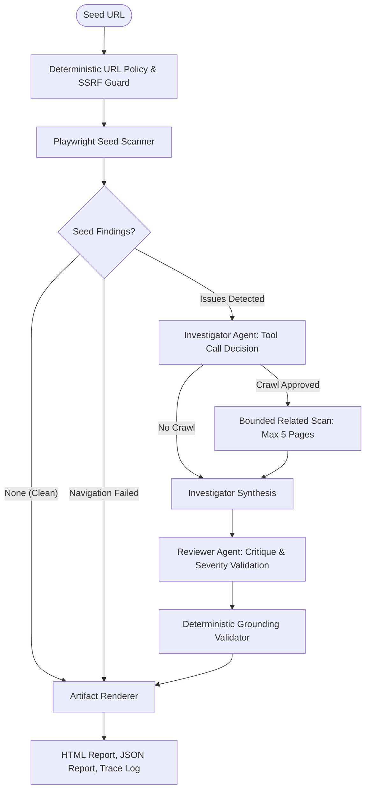

# AI Web Auditor (Website Reliability Agent)

[](https://github.com/parovozUA/ai-web-auditor/actions/workflows/ci.yml)
[](https://www.python.org/downloads/)
[](https://opensource.org/licenses/Apache-2.0)

**AI Web Auditor** is an autonomous, production-grade website reliability and SEO auditor. It pairs deterministic browser instrumentation with bounded dual-agent AI reasoning to uncover, correlate, and prioritize website defects without hallucinated evidence or unbounded crawling.

---

## Key Capabilities

- **Deterministic Safety Guardrails:** Strict SSRF protection via pre-flight DNS pinning, canonical URL normalization, same-origin restrictions, and automatic credential/query parameter masking (`***`).
- **Deep Browser Instrumentation:** Headless Chromium instrumentation via Playwright capturing uncaught JavaScript exceptions, page console errors, failed network requests, HTTP error statuses, missing/duplicate SEO tags, and broken internal links.
- **Bounded Dual-Agent Architecture:** Powered by Google Gemini (`gemini-3.5-flash`) orchestrated with LangGraph. Employs an **Investigator Agent** (to discover cross-page patterns with at most one tool invocation scanning up to 5 related pages) and an independent **Reviewer Agent** (to filter false positives and validate remediation clarity).
- **Deterministic Grounding Engine:** Pure validation layer that prunes hallucinated finding IDs, verifies evidence citations, and recomputes affected page sets directly from observed data.
- **Graceful Operational Degradation:** Skips agent execution entirely on clean pages or unrecoverable navigation failures, and falls back to deterministic finding tables if model APIs are unavailable or fail.
- **Self-Contained Static Reports:** Generates standalone dark-mode HTML reports, machine-readable JSON summaries, and execution trace logs.

---

## Architecture Overview



---

## Evaluation Benchmark

The system is evaluated against a 5-case benchmark verifying routing, finding recall, claim grounding, pattern detection, and bounded execution:

| Metric | Target | Result | Description |
| :--- | :---: | :---: | :--- |
| **Routing Accuracy** | `100%` | **`100%`** | Correctly skips AI on clean pages; routes to investigator only on findings. |
| **Finding Recall** | `100%` | **`100%`** | Captures all deterministic SEO, JS, link, and network anomalies. |
| **Grounded Claim Precision** | `100%` | **`100%`** | Zero hallucinated finding IDs or unobserved page citations in incidents. |
| **Pattern Recall** | `100%` | **`100%`** | Correctly identifies multi-page correlated root causes (e.g. shared widget failures). |
| **Related Page Limit** | `<= 5` | **`2` (<= 5)** | Enforces strict bound on secondary pages crawled per run. |
| **Schema Validity** | `100%` | **`100%`** | All generated JSON and report models strictly conform to Pydantic schemas. |

---

## Quickstart

### 1. Prerequisites
- Python 3.13+
- [`uv`](https://docs.astral.sh/uv/) package manager

### 2. Installation
```bash
# Clone the repository
git clone https://github.com/parovozUA/ai-web-auditor.git
cd ai-web-auditor

# Install dependencies into virtual environment
uv sync --all-extras

# Install Playwright browser dependencies
uv run playwright install --with-deps chromium
```

### 3. Environment Configuration
Create a `.env` file (see `.env.example`):
```bash
cp .env.example .env
```
Add your Google Gemini API key:
```ini
GEMINI_API_KEY=your_gemini_api_key_here
```
*(Note: Clean scans and deterministic tests run entirely offline without requiring a Gemini API key.)*

### 4. Running an Audit
```bash
# Scan a live website
uv run python -m website_reliability_agent scan https://example.com

# Scan a local fixture or test server (permits loopback addresses)
uv run python -m website_reliability_agent scan http://127.0.0.1:8765/seo --allow-private
```

---

## CLI Reference

```text
usage: website-reliability-agent scan [-h] [--allow-private] [--model MODEL]
                                     [--artifacts-dir ARTIFACTS_DIR]
                                     url

positional arguments:
  url                   Target seed URL to scan

options:
  -h, --help            show this help message and exit
  --allow-private       Permit loopback, private, and local fixture addresses
  --model MODEL         Gemini model name (default: gemini-3.5-flash)
  --artifacts-dir ARTIFACTS_DIR
                        Directory root for output artifacts (default: artifacts)
```

### Exit Codes
- `0`: Scan completed cleanly with zero findings.
- `1`: Scan completed with deterministic findings and/or AI incidents.
- `2`: Seed navigation failure or fatal operational error.

---

## Testing and Verification

```bash
# Run all unit, agent, and integration tests
uv run pytest -m "not live" -v

# Run the 5-case benchmark evaluation suite
uv run python scripts/run_evals.py

# Run static type checking and linting
uv run ruff check .
uv run mypy src/ tests/ scripts/

# Build package wheel and sdist
uv build
```

---

## License

Licensed under the [Apache License, Version 2.0](LICENSE). Copyright 2026 parovozUA.
