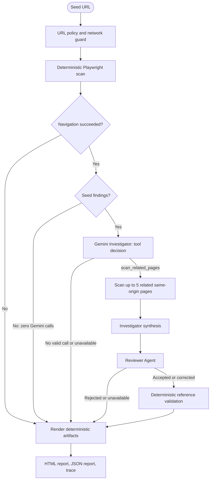

# AI Web Auditor

[](https://github.com/parovozUA/ai-web-auditor/actions/workflows/ci.yml)
[](https://parovozua.github.io/ai-web-auditor/)
[](https://python.langchain.com/)
[](https://langchain-ai.github.io/langgraph/)
[](https://ai.google.dev/gemini-api/docs/models/gemini-3.5-flash)

**Deterministic first. Agentic only when needed.**

AI Web Auditor is a command-line tool that scans a single URL with Playwright for SEO issues, JavaScript errors, broken internal links, and failed resources.

When the seed page contains findings, a bounded LangGraph workflow can use Gemini to inspect up to five related same-origin pages, group recurring issues into incidents, review the analysis, and generate evidence-linked HTML and JSON reports with an execution trace.

**[View the live sample report](https://parovozua.github.io/ai-web-auditor/)**

## Agent workflow



### Specialized roles

**Investigator**

- Receives deterministic findings as untrusted structured data.
- Decides whether to call the single allowed tool, `scan_related_pages`.
- Synthesizes seed and related-page findings into incident proposals.
- Suggests severity and remediation without inventing source-code causes.

**Reviewer**

- Uses a separate system prompt and structured output schema.
- Has no tools.
- Accepts, corrects, or rejects the proposed incident grouping.
- Checks finding references, severity, and remediation clarity.

**Grounding validator**

- Is deterministic and does not call an LLM.
- Removes finding IDs that do not exist in scanner output.
- Drops incident proposals that have no valid findings.
- Recomputes affected pages directly from validated findings.

The Investigator and Reviewer may use the same configured Gemini model, but they operate as separate role-specific stages in the graph.

## What it checks

| Category | Finding codes | Detection |
| --- | --- | --- |
| SEO | `title_missing` | Missing or empty `<title>` |
| SEO | `h1_missing` | Page contains no `<h1>` |
| SEO | `h1_multiple` | Page contains more than one `<h1>` |
| SEO | `meta_description_missing` | Missing or empty meta description |
| JavaScript | `console_error` | Console errors and uncaught page exceptions |
| Links | `broken_internal_link` | Same-origin internal links that fail or return HTTP 4xx/5xx |
| Resources | `resource_http_error` | Failed non-navigation requests and resource HTTP 4xx/5xx responses |
| Navigation | `navigation_failed` | URL-policy rejection or Playwright navigation failure |

The link checker validates up to 50 same-origin internal links per scanned page.

## Execution bounds and guardrails

- Only `http` and `https` URLs are accepted.
- Embedded URL credentials are rejected.
- Non-global and private network targets are blocked by default.
- Related-page selection and internal-link validation remain same-origin.
- At most five related pages are selected in DOM order.
- The related-page tool can execute at most once per run.
- Related scans evaluate only finding codes observed on the seed page.
- Web observations are delimited and treated as untrusted prompt data.
- Agent responses must conform to strict Pydantic schemas.
- Model failures produce a deterministic fallback report.

> [!IMPORTANT]
> URL validation reduces SSRF exposure but is not a replacement for network-level sandboxing. Use `--allow-private` only for trusted local fixtures.

> [!NOTE]
> Query values inside finding URLs are masked. The original seed URL is retained in report metadata, so do not place credentials or secrets in the URL.

## Quickstart

### Prerequisites

- Python 3.13
- [`uv`](https://docs.astral.sh/uv/)
- Chromium installed through Playwright

### Installation

```bash
git clone https://github.com/parovozUA/ai-web-auditor.git
cd ai-web-auditor

uv sync --all-extras
uv run playwright install --with-deps chromium
```

### Gemini configuration

Create a `.env` file in the repository root:

```ini
GEMINI_API_KEY=your_gemini_api_key
```

The API key is optional for deterministic scanning:

- A clean scan makes no Gemini calls.
- If findings exist but Gemini is unavailable, the tool still generates deterministic reports.
- A successful full agent path uses up to three model calls: tool decision, investigation, and review.

## Usage

Scan a public page:

```bash
uv run ai-web-auditor scan https://example.com
```

Select another Gemini model:

```bash
uv run ai-web-auditor scan https://example.com --model gemini-3.5-flash
```

Choose a custom artifact directory:

```bash
uv run ai-web-auditor scan https://example.com --artifacts-dir audit-results
```

### Run against the local fixture site

Start the fixture server:

```bash
uv run python tests/fixture_site.py --port 8765
```

In another terminal:

```bash
uv run ai-web-auditor scan http://127.0.0.1:8765/seo --allow-private
```

## CLI options

| Option | Default | Description |
| --- | --- | --- |
| `url` | Required | Seed URL to scan |
| `--allow-private` | Disabled | Allow loopback and private network targets |
| `--model` | `gemini-3.5-flash` | Gemini model used by agent stages |
| `--artifacts-dir` | `artifacts` | Root directory for generated run artifacts |

### Exit codes

| Code | Meaning |
| ---: | --- |
| `0` | Scan completed with no deterministic findings |
| `1` | Scan completed with one or more findings |
| `2` | Seed navigation failed or a fatal operational error occurred |

Exit codes depend on deterministic scan results, not on whether Gemini produced incidents.

## Output artifacts

Each invocation creates a unique run directory:

```text
artifacts/
└── run-YYYYMMDD-HHMMSS-xxxxxx/
    ├── report.html
    ├── report.json
    └── trace.json
```

| Artifact | Contents |
| --- | --- |
| `report.html` | Self-contained dark-mode report with findings, incidents, operational notices, and trace events |
| `report.json` | Machine-readable run metadata, findings, validated incidents, and analysis status |
| `trace.json` | Graph-node statuses, elapsed time, counts, tool execution, model usage when available, and error categories |

The HTML file can be opened locally without running a server.

## Evaluation

The repository contains a five-case seeded benchmark covering:

1. Clean-page routing
2. Repeated SEO findings
3. Repeated JavaScript failures
4. Broken links and failed resources
5. Mixed findings with partial cross-page recurrence

Run it with:

```bash
uv run python scripts/run_evals.py
```

Metrics are written to:

```text
artifacts/evals/<timestamp>/metrics.json
```

The default benchmark uses local fixture pages and a deterministic fake agent backend. It validates routing, contracts, grounding, and execution bounds without introducing model variance.

It is not presented as a general benchmark of Gemini reasoning quality.

An opt-in live Gemini smoke test is available separately:

```bash
uv run pytest -m live -v
```

`GEMINI_API_KEY` must be exported in the test process environment. Live tests are excluded from CI.

## Development

Run the non-live test suite:

```bash
uv run pytest -m "not live" -v
```

Run linting and static type checking:

```bash
uv run ruff check .
uv run mypy src/ tests/ scripts/
```

Build the package:

```bash
uv build
```

GitHub Actions runs linting, type checking, non-live tests, seeded evals, and package builds on Linux, Windows, and macOS.

## Technology stack

| Area | Technology |
| --- | --- |
| Browser instrumentation | Playwright |
| Link validation | HTTPX |
| Agent orchestration | LangGraph |
| Agent integration | LangChain Core and Google Gemini |
| Data contracts | Pydantic v2 |
| Reporting | Jinja2 and JSON |
| Testing | pytest and pytest-asyncio |
| Quality | Ruff and mypy |
| Packaging | Hatchling and uv |
| Automation | GitHub Actions and GitHub Pages |

## License

This project is available under the [MIT License](LICENSE).